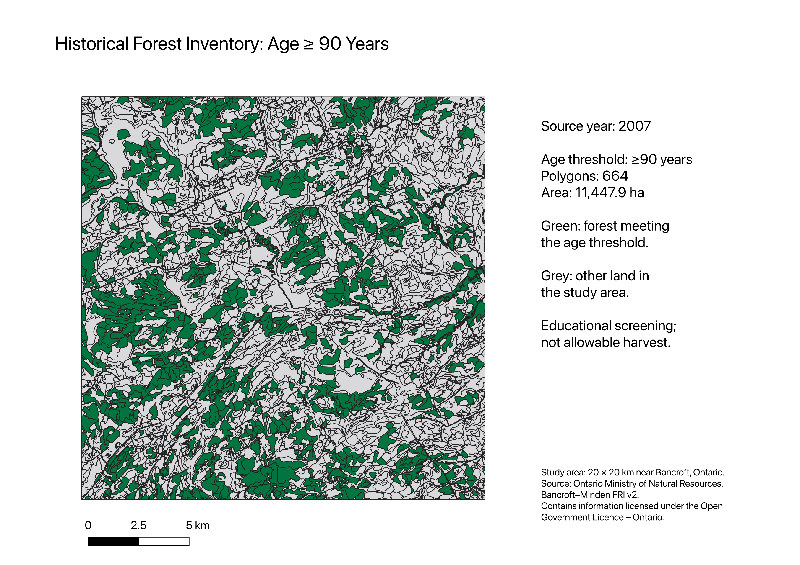
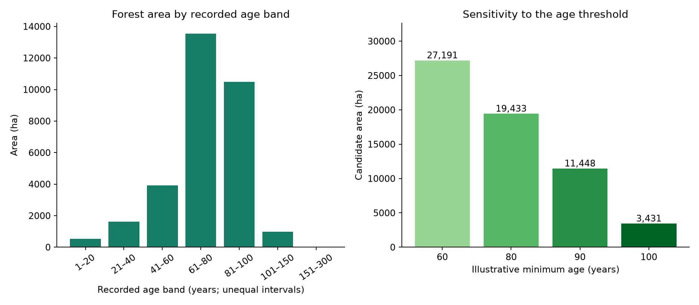

# Ontario Forest Inventory: Spatial Analysis and Age-Threshold Scenarios

A reproducible Python, SQL and QGIS case study of historical forest inventory near Bancroft, Ontario. The project examines forest age structure, validates spatial and tabular data, and measures how candidate area changes under four illustrative age thresholds.



## Key results

The 20 × 20 km study area contains **3,581 polygons** and **31,063.52 ha of forest** with usable recorded ages.

| Minimum recorded age | Polygons | Candidate area (ha) | Share of usable forest |
|---|---:|---:|---:|
| 60 years | 1,739 | 27,191.03 | 87.5% |
| 80 years | 1,162 | 19,432.53 | 62.6% |
| 90 years | 664 | 11,447.93 | 36.9% |
| 100 years | 183 | 3,431.37 | 11.0% |

Increasing the age threshold from 80 to 90 years reduces candidate area by **41.1%**. This illustrates sensitivity to a screening assumption; it does not establish an appropriate harvest age or an approved harvest level.



## Workflow

1. Read the official Bancroft–Minden Forest Resources Inventory v2 geodatabase.
2. Inspect source dates, land classifications, identifiers and recorded ages.
3. Select a local study square, repair invalid geometries and clip polygons to its boundary.
4. Calculate area in NAD83 / UTM zone 17N and filter to forest records with usable ages.
5. Compare 60-, 80-, 90- and 100-year age screens using Python.
6. Verify area totals using SQL and reproduce the 90-year result in QGIS.
7. Create maps, a technical report and a reusable notebook.

## Data quality findings

- All 110,053 source-layer records have `YRSOURCE=2007`, although the package is named 2008. Ages are retained as recorded.
- Repeated polygon IDs are flagged rather than automatically deleted. Distinct source features may share an identifier.
- One full-layer forest record has age above an analyst-selected 300-year review cutoff. No selected local forest record fails the age rule.
- Four selected geometries required repair. After clipping, coverage is 40,000 ha with no meaningful residual overlap.
- Python and SQL area summaries agree, and screened area decreases as the threshold increases.

## Explore the project

- [Executed notebook](learning_notebook.ipynb): inspect the data, reproduce scenarios and explore another threshold.
- [Study summary](PROJECT_SUMMARY.md): methods, findings and limitations.
- [SQL queries](queries.sql): transparent checks and summaries.
- [Scenario table](results/scenarios.csv) and [quality audit](results/audit.json).
- [QGIS project](my_forest_analysis.qgz): saved layers and applicant-created print layout.
- [HTML report](results/report.html): download or clone the repository and open this file in a browser. GitHub's file view does not render it as a webpage.

## Run the notebook

Python 3.12 was used. From the repository folder:

```sh
python3 -m venv .venv
source .venv/bin/activate
python -m pip install -r requirements.txt
python -m pip install ipykernel
```

Open `learning_notebook.ipynb` in VS Code with the Python and Jupyter extensions, select `.venv` as the kernel, and run the cells. The first cell restores the small study GeoPackage from the included archive. No full-source download is needed. The notebook contains saved outputs from a successful execution.

## Open the QGIS project

```sh
python3 prepare_data.py
```

Then open `my_forest_analysis.qgz` in QGIS. The project uses relative paths to `results/inventory.gpkg`. The GeoPackage is archived to keep each uploaded file below GitHub's browser-upload size limit.

## Reproduce the original spatial workflow

Download and extract the [official Bancroft–Minden source archive](https://ws.gisetl.lrc.gov.on.ca/fmedatadownload/Packages/pp_FRI_FIMv2_BancroftMindenForest_2008_2D.zip). The archive is about 883 MB and expands to about 2.7 GB. The full source data is excluded from this repository.

With the Python environment activated:

```sh
python analyze.py --source /path/to/pp_FRI_FIMv2_BancroftMindenForest_2008_2D.gdb
```

Default thresholds are 60, 80, 90 and 100 years. For an alternative run:

```sh
python analyze.py --source /path/to/source.gdb --thresholds 70 90 110
```

Alternative runs overwrite generated results. The exported QGIS PNG and its saved project remain the original 90-year example; update those separately if the study or assumptions change.

## Assumptions and limitations

This is **historical inventory analysis and age screening**, not a forest estate simulation or allowable-harvest determination. The local square is deliberately selected, not a representative sample of the full management unit. `OAGE` is treated as recorded overstorey age; detailed field semantics should be checked against the authoritative technical specification before operational use.

The thresholds are educational assumptions, not Ontario policy or species-specific maturity criteria. Ownership, protected areas, habitat, water buffers, access and silvicultural constraints are not applied. One overstorey age cannot fully represent uneven-aged stands. Growth/yield, regeneration, disturbance, wood volume and socioeconomic impacts are not modelled. Historical ages cannot be converted into current conditions simply by adding elapsed years.

## Next steps

Verify flagged source values, incorporate land tenure and ecological constraints, and add species-appropriate growth/yield and renewal parameters for multi-period modelling.

## Data attribution and contribution

Source: Ontario Ministry of Natural Resources / Land Information Ontario, [Forest Resources Inventory Packaged Products – Version 2](https://www.arcgis.com/home/item.html?id=9de0dad6f1b3435eb46df8ee49f4ecfd), Bancroft–Minden package. Downloaded 8 October 2026. Contains information licensed under the [Open Government Licence – Ontario](https://www.ontario.ca/page/open-government-licence-ontario). Source metadata and archive SHA-256 are recorded in [provenance.json](provenance.json). Derived study extracts and maps are modified outputs, not official ministry products; no ministry endorsement is implied.

The author independently completed QGIS filtering, area verification and map-layout export. Python implementation and report preparation were assisted by AI. The methods and limitations are documented so the work can be inspected and reproduced.
